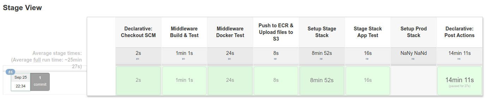

# Interview Take Home Project
## Review 2018-09-25

I've found a bug with the build script where I was using the pipe `|` instead of ORing with `||` to ignore errors with the `terraform destroy` commands. I've also missed out some required variable in the terraform destroy script resulting it terraform not being able to destroy the stack. I extracted a complete build log with terraform apply from cold start to destroy in one single process.

There's currently still some random issue when destroying, which I'll working on next along with more Chef involvement. 

The state of the code discussed here is in the `review-2018-09-25` branch.    

Below is the snapshot of the pipeline from cold start

